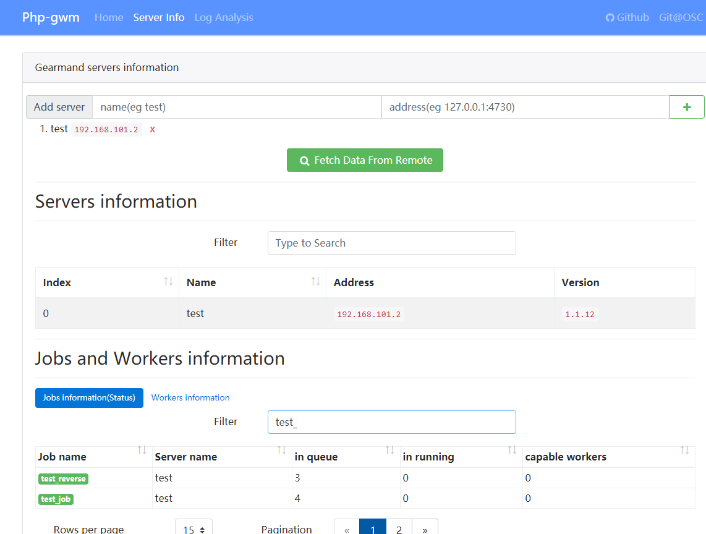
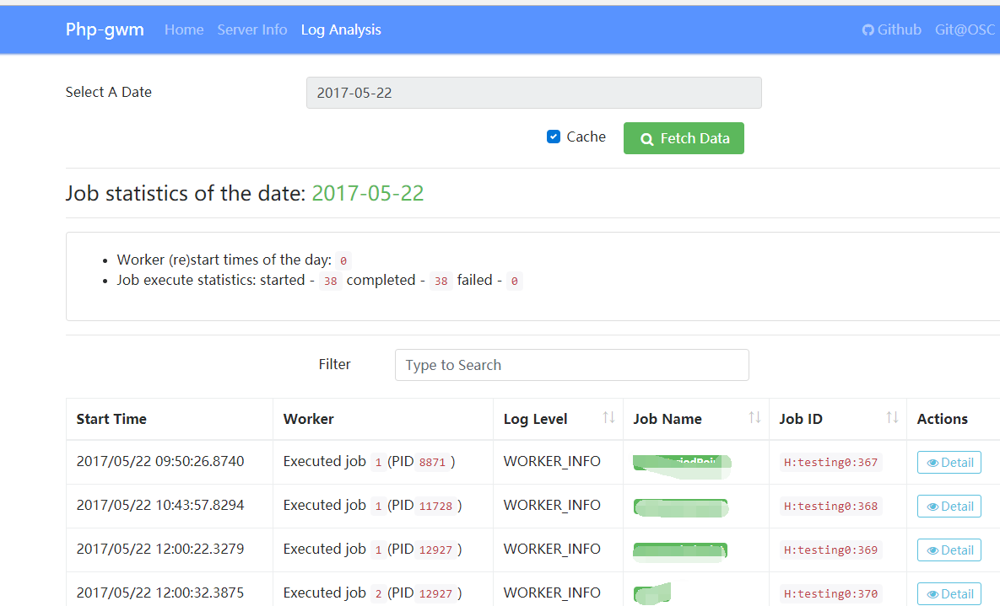

# gearman manager

a php gearman workers manager.

> [中文README](README_zh.md)

Can start and manage multiple gearman worker, you can set the maximum execution time of 
each worker and the maximum number of job execution, after reaching the set value.
Worker will automatically restart the process, prevent the dead

Learning reference the project **[brianlmoon/GearmanManager](https://github.com/brianlmoon/GearmanManager)**, Thank you very much for this project.

add some feature:

- Code is easier to read and understand
- Can support `start` `reload` `restart` `stop` `status` command
- More useful feature

> only support linux system, and require enable `pcntl` `posix` 

### basic commands

- start

```bash
// start
php bin/manager.php 
// run as daemon
php bin/manager.php --daemon 
```

- stop 

```bash 
php bin/manager.php stop
```

- restart

```bash
php bin/manager.php restart
```

- more

```bash
// see help info
php bin/manager.php --help

// print manager config info
php bin/manager.php -D

// jobs status
php bin/manager.php status
php bin/manager.php status --cmd status

// workers status
php bin/manager.php status --cmd workers
```

## commands and options

use `php examples/gwm.php -h`, you can see all commands and options.

```
root@php5-dev:/var/www/phplang/library/gearman-manager# php examples/gwm.php -h
Gearman worker manager(gwm) script tool. Version 0.1.0

USAGE:
  php examples/gwm.php {COMMAND} -c CONFIG [-v LEVEL] [-l LOG_FILE] [-d] [-w] [-p PID_FILE]
  php examples/gwm.php -h
  php examples/gwm.php -D

COMMANDS:
  start             Start gearman worker manager(default)
  stop              Stop running's gearman worker manager
  restart           Restart running's gearman worker manager
  reload            Reload all running workers of the manager
  status            Get gearman worker manager runtime status

SPECIAL OPTIONS:
  start/restart
    -w,--watch         Automatically watch and reload when 'loader_file' has been modify
    -d,--daemon        Daemon, detach and run in the background
       --jobs          Only register the assigned jobs, multi job name separated by commas(',')
       --no-test       Not add test handler, when job name prefix is 'test'.(eg: test_job)

  status
    --cmd COMMAND      Send command when connect to the job server. allow:status,workers.(default:status)
    --watch-status     Watch status command, will auto refresh status.

PUBLIC OPTIONS:
  -c CONFIG          Load a custom worker manager configuration file
  -s HOST[:PORT]     Connect to server HOST and optional PORT, multi server separated by commas(',')

  -n NUMBER          Start NUMBER workers that do all jobs

  -u USERNAME        Run workers as USERNAME
  -g GROUP_NAME      Run workers as user's GROUP NAME

  -l LOG_FILE        Log output to LOG_FILE or use keyword 'syslog' for syslog support
  -p PID_FILE        File to write master process ID out to

  -r NUMBER          Maximum run job iterations per worker
  -x SECONDS         Maximum seconds for a worker to live
  -t SECONDS         Number of seconds gearmand server should wait for a worker to complete work before timing out

  -v [LEVEL]         Increase verbosity level by one. (eg: -v vv | -v vvv)

  -h,--help          Shows this help information
  -V,--version       Display the version of the manager
  -D,--dump [all]    Parse the command line and config file then dump it to the screen and exit.
```

### add handler

you can add job handler use: `function` `Closure` `Class/Object`

> class or object must be is a class implement the `__invoke()` or a class implement the interface `inhere\gearman\jobs\JobInterface`

- file: `job_handlers.php`

```php

/**
 * a class implement the '__invoke()'
 */
class TestJob
{
    public function __invoke($workload, \GearmanJob $job)
    {
        echo "from TestJob, call by __invoke";
    }
}

// add job handlers

$mgr->addHandler('reverse_string', function ($string, \GearmanJob $job)
{
    $result = strrev($string);

    echo "Result: $result\n";

    return $result;
});

$mgr->addHandler('test_job', TestJob::class);

// use a class implement the interface `inhere\gearman\jobs\JobInterface`, add some option for the job.
$mgr->addHandler('echo_job', \inhere\gearman\examples\jobs\EchoJob::class, [
    'worker_num' => 2,
    'focus_on' => 1,
]);
```

- extends `inhere\gearman\Job`

```php

/**
 * Class EchoJob
 * @package inhere\gearman\jobs
 */
class EchoJob extends Job
{
    /**
     * {@inheritDoc}
     */
    protected function doRun($workload, \GearmanJob $job)
    {
        echo "receive: $workload";
    }
}
```

### start manager

use `php gwm.php -h` see more help information

run: `php gwm.php`

## monitor web panel

you can see the server, jobs, workers info by built-in tool.

run：

```bash
bash server.sh
// OR
php -S 127.0.0.1:5888 -t web
```

open the url http://127.0.0.1:5888 

- server,jobs info



- see log



## License

BSD
