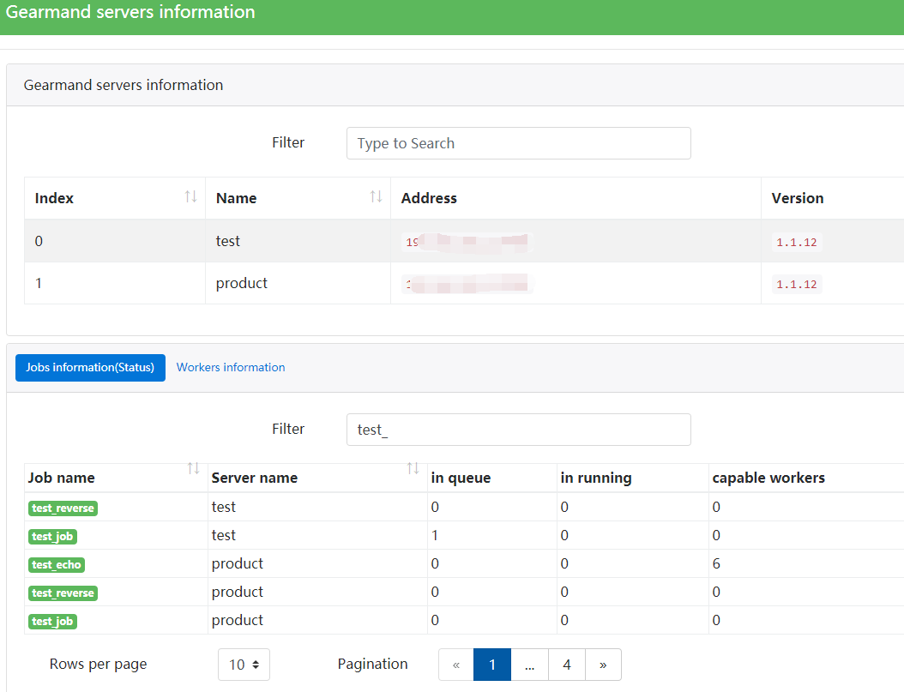

# gearman worker manager

php 的 gearman workers 管理工具。

学习并参考自项目 **[brianlmoon/GearmanManager](https://github.com/brianlmoon/GearmanManager)**, 

代码风格有点老了:)，并且是以一个文件写一个函数的方式添加job handler. 没有停止等命令。

但是非常感谢这个项目，大部分逻辑思想都来自于它。

功能特色:

- 可同时启动并管理多个gearman worker，并会监控运行状态，worker异常退出会自动再重启一个对应的worker
- 可以设置每个worker的最大执行时间(默认一小时左右)和最大job执行数量(默认3000个)，到达设定值后,会自动重启worker，防止进程僵死
- 可以自定义worker数量，也可以针对job设置worker数量。还可以让worker专注指定的job。
- 代码容易阅读和理解，写了较详细的注释:)
- 支持 `start` `reload` `restart` `stop` `status` 命令，重启不会干扰job的完成(worker会等待当前job处理后退出). 支持守护进程方式运行
- 详细的运行日志(启动、重启、停止、收到job...)，可以按天或小时存放日志. 可以自定义日志级别
- 内置了几个有趣的job handler 基类，可以快速的上手。 `examples` 目录下的可以直接运行，当然得先安装好 gearmand server.
- 内置了简单的 `curl` `telnet` `monitor` `logger` 等工具类
- 内置了简单的 monitor 的web面板

> 只支持 linux 环境， 需要php的 `pcntl` `posix` 扩展. macOs 应该也可以用，但没测试。
> php >= 5.6 and < 7.0.0(php的gearman扩展不支持7)

## 获取安装

- composer:

```
"require": {
    "inhere/gearman": "dev-master"
},
```

- github

直接从github拉取`git clone http://github.com/inhere/php-gearman-manager`

## 基本命令

- 启动

```bash
// 启动
php examples/gwm.php 
// 后台运行
php examples/gwm.php -d
php examples/gwm.php --daemon
```

- 停止 

```bash 
php examples/gwm.php stop
```

- 重启

```bash
php examples/gwm.php restart
```

- 其他

```bash
// 查看帮助信息 可看到更多的可用选项
php examples/gwm.php --help

// 打印manager配置信息
php examples/gwm.php -D
```

## 命令以及选项说明

在命令行里使用 `php examples/gwm.php -h` 可以查看到所有的命令和选项信息

> 命令行里设定的选项将会覆盖文件配置。

```
root@php5-dev:/var/www/phplang/library/gearman-manager# php examples/gwm.php -h
Gearman worker manager(gwm) script tool. Version 0.1.0

USAGE:
  php examples/gwm.php {COMMAND} -c CONFIG [-v LEVEL] [-l LOG_FILE] [-d] [-w] [-p PID_FILE]
  php examples/gwm.php -h
  php examples/gwm.php -D

COMMANDS:
  start             Start gearman worker manager(default)
  stop              Stop running's gearman worker manager
  restart           Restart running's gearman worker manager
  reload            Reload all running workers of the manager
  status            Get gearman worker manager runtime status

SPECIAL OPTIONS:
  start/restart
    -w,--watch         Automatically watch and reload when 'loader_file' has been modify(TODO)
    -d,--daemon        Daemon, detach and run in the background
       --jobs          Only register the assigned jobs, multi job name separated by commas(',') // 设定只加载这几个job handler，防止其他的job干扰。测试时很有用，
       --no-test       Not add test handler, when job name prefix is 'test'.(eg: test_job) // 不加载以test为前缀的handler。如在生产环境时

  status
    --cmd COMMAND      Send command when connect to the job server. allow:status,workers.(default:status) // 查看job server的信息
    --watch-status     Watch status command, will auto refresh status.

PUBLIC OPTIONS:
  -c CONFIG          Load a custom worker manager configuration file
  -s HOST[:PORT]     Connect to server HOST and optional PORT, multi server separated by commas(',')

  -n NUMBER          Start NUMBER workers that do all jobs

  -u USERNAME        Run workers as USERNAME
  -g GROUP_NAME      Run workers as user's GROUP NAME

  -l LOG_FILE        Log output to LOG_FILE or use keyword 'syslog' for syslog support
  -p PID_FILE        File to write master process ID out to

  -r NUMBER          Maximum run job iterations per worker // 启动多少个worker来做job。这些worker是随机接收并处理job。如需对某个job特殊处理，需单独配置它
  -x SECONDS         Maximum seconds for a worker to live
  -t SECONDS         Number of seconds gearmand server should wait for a worker to complete work before timing out

  -v [LEVEL]         Increase verbosity level by one. (eg: -v vv | -v vvv)

  -h,--help          Shows this help information
  -V,--version       Display the version of the manager
  -D,--dump [all]    Parse the command line and config file then dump it to the screen and exit.
```

## 添加job handler(工作处理器)

方法原型：

```php
bool BaseManager::addHandler(string $name, mixed $handler, array $opts = [])
bool BaseManager::addFunction(string $name, mixed $handler, array $opts = []) // addHandler 的别名方法
```

参数：

- `$name` string 名称，给此工作命名
- `$handler` mixed 此工作的处理器。 可以是 函数名称，类名称，对象实例，闭包
    - 使用类名称或对象实例 时，必须是 实现了接口 `app\gearman\JobInterface`( **推荐** ) 或者 实现了 `__invoke` 方法
- `$opts` array 对当前工作的一些设置
    - `timeout` int 超时 秒
    - `worker_num` int 需要多少个worker来处理此工作
    - `focus_on` bool 需要上面的worker专注此工作，即只负责它，不再接其他的job

示例：

```php
// $mgr 是 inhere\gearman\GwManager 的实例

$mgr->addHandler('echo_job', \inhere\gearman\examples\jobs\EchoJob::class);

// 对此job特殊设置 - 至少有4个worker做此工作，这些worker也同时会做其它的job
$mgr->addHandler('echo_job', MyJob::class, [
    'worker_num' => 4, 
]);

// 对此job特殊设置 - 有2个worker专注做此工作，不接其它的job
$mgr->addHandler('echo_job', MyOtherJob::class, [
    'worker_num' => 2, 
    'focus_on' => 1, 
]);

/**
 * test
 */
$mgr->addFunction('test_reverse', function ($workload)
{
    return ucwords(strtolower($workload));
});

```

## manager 配置

全部的配置项请查看 `BaseManager::$config`

## job 配置

可以针对job进行特殊配置, 下面是可用配置项:

```php
// BaseManager::$defaultJobOpt
[
    // 需要 'worker_num' 个 worker 处理这个 job
    'worker_num' => 0,
    // 当设置 focus_on = true, 这些 worker 将专注这一个job
    'focus_on' => false, // true | false
    // job 执行超时时间 秒
    'timeout' => 200,
]
```

## 内置工具

### 文件日志

提供了简单的文件日志记录工具类。

- 初始化存储目录

```php
FileLogger::create(__DIR__ . '/logs/jobs', FileLogger::SPLIT_DAY);
```

- 使用 

```php 
... ...
FileLogger::info('message', ['data'], 'test_job');
FileLogger::err('message', ['data'], 'test_job');
```

同时内置了 `inhere\gearman\jobs\UseLogJob` job handler 基类。 使用job类并继承它，就可以方便的记录日志

```php 
use inhere\gearman\jobs\UseLogJob;

class MyJob extends UseLogJob
{
    /**
     * {@inheritDoc}
     */
    protected function doRun($workload, \GearmanJob $job)
    {
        $this->info("received workload=$workload");
        $this->err("error ...");

        echo "receive: $workload\n";

    }
}
```

### 请求转发Job handler

提供了请求转发job基类: `inhere\gearman\jobs\RequestProxyJob`.

- 通用的请求转发工作处理器基类.
- 你只需要关注数据验证，设置好正确的 `$baseUrl`(api host) 和 `$path`(api path) (可选的 `$method`)
- 正确的数据将会原样的发送给接口地址(`$baseUrl + $path`)

使用：

1. 不关注数据格式，使用： `inhere\gearman\jobs\StdRequestProxyJob`

`StdRequestProxyJob` 通用的项目请求代理job handler,继承自 `RequestProxyJob`. 

针对通用的不在此处关心数据格式的内部接口，即是原样的数据转发

usage:

```php
$mgr->addHandler('user_api', new StdRequestProxyJob('http://user.domain.com'));
$mgr->addHandler('goods_api', new StdRequestProxyJob('http://goods.domain.com'));
```

in client:

```php
$client->doBackground('user_api', [
    '_uri' => '/update-info', // will request: http://user.domain.com/update-info
    'userId' => 123,
    // ... ...
]);
```

2. 继承 `inhere\gearman\jobs\RequestProxyJob`

对一些要求高的api，想在数据转发前做一些事情，比如 验证数据结构。

```php
class UserAfterRegisterJob extends RequestProxyJob
{
  protected function beforeSend(array &$payload)
  {
      if (!isset($payload['userId']) || $payload['userId'] <= 0) {
          return false;
      }

      $this->baseUrl = 'http://inner-api.domain.com';
      $this->path = '/user/after-register';

      return true;
  }
}
```

## monitor的web面板

内置了简单的 monitor 的web面板，可以查看 server, jobs, workers 的信息。

> 只是简单的实现，刷新一次页面才更新一次信息。 但是相关工具类已经提供，可以自己自定义扩展。

在项目目录执行：

```bash
 php -S 127.0.0.1:5888 -t monitor
```

然后打开浏览器访问 http://127.0.0.1:5888 效果：



## License

BSD
